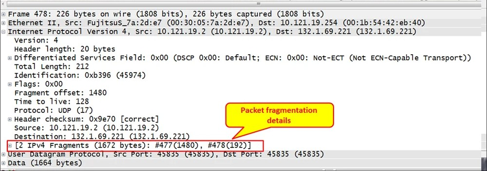
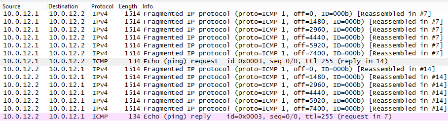

# XDP-Based Network Detection Pipeline

> Kernel-level packet inspection using XDP/eBPF for early-stage filtering and TCP fingerprint-based detection at line rate.

Processes packets before SKB allocation to reduce kernel overhead and enable high-performance traffic filtering.

---

## Architecture

```
NIC
↓
[XDP Layer - eBPF]
Packet parsing (Ethernet/IP/TCP/UDP)
IP-based firewall (LPM trie)
Port-based filtering
TCP SYN fingerprinting (JA4T-style)
TCP handshake latency tracking (JA4L-inspired)
↓
Decision
├── DROP → malicious traffic (XDP_DROP)
└── PASS → forwarded to kernel / IDS (Suricata)
```

---

## Key Features

- XDP-based packet processing (pre-SKB)
- IPv4/IPv6 support
- LPM-based IP blocking
- TCP SYN fingerprinting (JA4T-style)
- TCP handshake latency tracking
- BPF map-based telemetry

---

## Performance

- ~10,000+ packets/sec (Scapy simulation)
- Sub-millisecond filtering at XDP layer
- No SKB allocation (zero-copy processing)

---

## Fragmented Packet Simulation

### Scapy Packet Generation


### Wireshark Fragmented Packets


### Fragment Offset & MF Flag


### Packet Reassembly View


---

## Detection Strategy

The system classifies packets into three categories:

1. **Known Malicious**

   * Blocked IPs / ports
   * Known bad TCP fingerprints
     → Dropped immediately (XDP_DROP)

2. **Suspicious Traffic**

   * Fragmented packets
   * Unusual TCP SYN behavior
   * Anomalous patterns
     → Redirected to user space (AF_XDP)

3. **Normal Traffic**
   → Passed to kernel for further inspection (e.g., Suricata)

---

## AF_XDP Role (Deep Analysis Layer)

While XDP performs fast, early-stage filtering, AF_XDP handles deeper and stateful packet analysis that is not feasible within eBPF constraints.

### 1. Fragment Reassembly

* Collect fragmented packets
* Reassemble full payload
* Detect fragmentation-based evasion

Example:

```
Fragment 1 → harmless  
Fragment 2 → harmless  
Combined → malicious payload  
```

→ XDP cannot reconstruct full payload
→ AF_XDP detects the attack

---

### 2. Advanced TCP Fingerprint Validation

* Correlate fingerprints across multiple packets
* Detect:

  * Inconsistent fingerprints
  * Spoofed TCP stacks
  * Scanning behavior

---

### 3. Behavioral Analysis

* Track traffic patterns per source
* Detect:

  * Port scans (same IP → multiple ports)
  * SYN floods (beyond simple rate limits)
  * Timing anomalies

---

### 4. Payload Inspection (Light DPI)

* Inspect packet payloads in user space
* Detect:

  * Suspicious strings
  * Malformed packets
  * Protocol violations

---

### 5. Feedback Loop to XDP

AF_XDP updates BPF maps based on analysis:

```c
bpf_map_update_elem(&banned_ips, ...);
bpf_map_update_elem(&blocked_tcp_fingerprints, ...);
```

→ Future packets are dropped early at XDP
→ Improves performance and reduces attack surface

---

## Why XDP?

* Runs before SKB allocation → reduces kernel overhead
* Enables early packet filtering
* Improves performance under high traffic load

---

## Validation

Traffic simulation and validation were performed using Scapy, Wireshark, and libpcap:

* Fragmented packet generation
* Packet capture and analysis
* TCP behavior inspection
* Detection of anomalous patterns


---

## Use Cases

- DDoS mitigation (early drop at XDP)
- IDS offloading (Suricata integration)
- Edge security (load balancers / cloud)

---

## Limitations

* eBPF programs are constrained (no heavy loops, limited memory)
* Deep packet inspection requires user-space handling (AF_XDP / Suricata)
* Limited application-layer visibility at XDP level

---

## Future Improvements

* Full AF_XDP userspace implementation
* Dynamic rule updates via control plane
* Integration with external threat intelligence feeds
* Advanced anomaly detection (ML-based)
