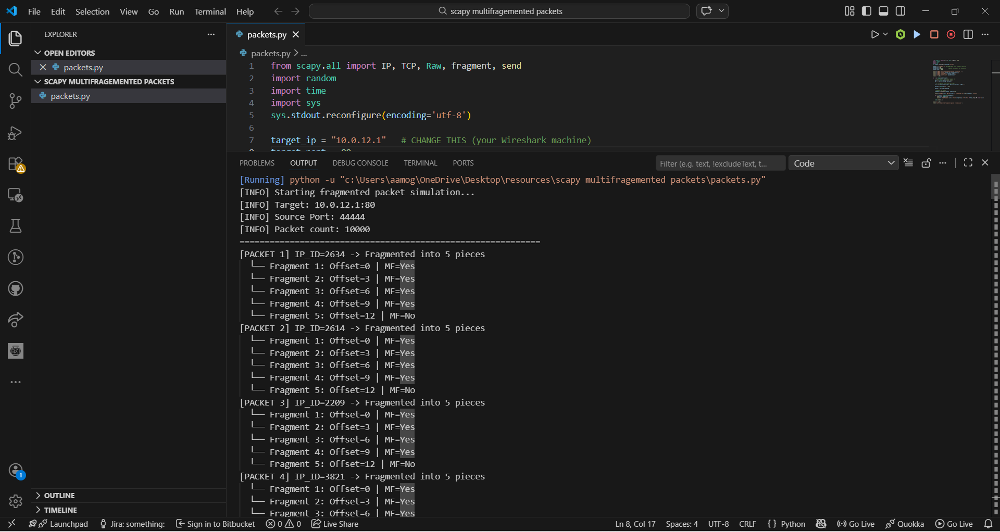
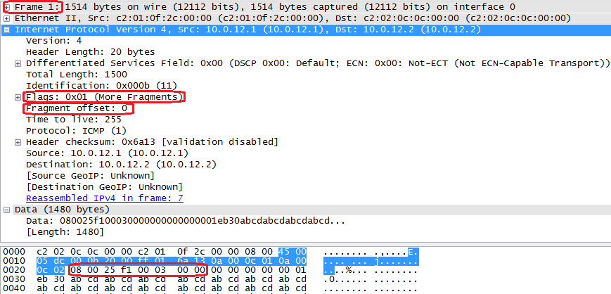

# XDP Network Detection Pipeline

High-performance packet filtering and TCP fingerprinting at the XDP layer.
Drops malicious traffic before SKB allocation — no kernel stack overhead,
no iptables, no conntrack.

---

## What it does

Attaches to a NIC's XDP hook and runs a staged pipeline on every inbound packet:

- LPM-trie IP ban check (CIDR support, IPv4 + IPv6)
- Per-(IP, port) inbound/outbound port filtering
- TCP SYN fingerprinting (JA4T-style)
- TCP handshake latency tracking (JA4L-inspired)

Packets that fail any stage are dropped at **XDP_DROP (pre-SKB)**.

---

## Design decisions

**Why XDP over iptables/nftables**
iptables runs post-SKB. Under a SYN flood or volumetric DDoS, SKB allocation
itself becomes the bottleneck. XDP bypasses that entirely.

**Why LPM trie for IP bans**
O(log n) prefix matching with CIDR support in a single `bpf_map_lookup_elem`
call. Supports /32 host bans and /24 subnet bans from the same map.

**Why separate compound and simple fingerprint maps**
`tcp_fp_v4` is keyed by (IP, port, fingerprint) for per-fingerprint accounting.
`tcp_fp_simple_v4` is keyed by (IP, port) only — gives userspace O(1) lookup
of the latest fingerprint for any active connection without iterating.

**Why approximate SYN-ACK timestamp**
XDP only sees inbound traffic. SYN-ACK is outbound. Rather than adding a TC
hook just for timestamp capture, `synack_time_ns` is set equal to `syn_time_ns`.
Client RTT (`ack_time_ns - syn_time_ns`) remains accurate. JA4TS SYN-ACK
capture is handled by a separate TC BPF program when needed.

**Verifier budget**
TCP option parsing is done once per packet in `parse_tcp_options()` (10-iteration
bounded loop). The fingerprint string is built with pure arithmetic — no loops.
This keeps the verifier instruction count well within the 1M limit even with
all modules inlined.

---

## Repository layout

```
kernel/
  xdp_pipeline.bpf.c   — pipeline entry point, SEC("xdp")
  maps.h               — all BPF map definitions
  common.h             — shared types, parse_and_advance(), IPv6 helpers
  modules/
    firewall.h         — IP + port filtering
    tcp_fingerprint.h  — JA4T SYN fingerprinting
    latency.h          — JA4L RTT tracking
userspace/
  loader.h             — libbpf loader stub (skeleton-based)
scripts/
  attach.sh / detach.sh
docs/
  architecture.md      — map inventory, fingerprint format, state machines
```

---

## Build & deploy

Requirements: `clang >= 12`, `llvm`, `libbpf-dev`, `linux-headers`, `bpftool`

```bash
make vmlinux          # generate vmlinux.h from running kernel (once)
make                  # compile BPF object + generate libbpf skeleton
sudo make check       # verifier dry-run
```

```bash
sudo ./scripts/attach.sh eth0 native   # native XDP (requires driver support)
sudo ./scripts/attach.sh eth0 skb      # generic fallback
sudo ./scripts/detach.sh eth0
```

BPF maps are pinned to `/sys/fs/bpf/xdp_pipeline/maps` on attach.
Userspace can read telemetry or push rule updates directly via `bpf_map_update_elem`.

<!-- SUGGESTED IMAGE: place a screenshot of bpftool map dump output here
     (assets/bpftool-maps-example.png) showing live telemetry from a running instance -->

---

## Fragmentation Evasion Simulation

### Scapy Packet Generation


### Fragmented Packets (Wireshark)


### Fragment Offset & MF Flag


### Packet Reassembly


---

## Telemetry

All counters are readable from userspace without reloading the program:

| Map | Contents |
|-----|----------|
| `stats_pkts_total` / `stats_pkts_dropped` | Global packet counters |
| `stats_ipv4_banned` / `stats_ipv6_banned` | Ban rule hit counts |
| `stats_tcp_fp_blocks_v4/v6` | Fingerprint block counts |
| `dropped_ipv4_counters` / `dropped_ipv6_counters` | Per-IP drop counts |
| `conn_latency_v4/v6` | Per-connection SYN/ACK timestamps + state |
| `tcp_fp_simple_v4/v6` | Latest fingerprint per (IP, port) |

---

## Validation

- Generated fragmented packets using Scapy
- Observed fragmentation behavior (MF flag, offsets) in Wireshark
- Verified packet handling at XDP layer before kernel processing

---

## Constraints

- BPF verifier limits loop depth — complex stateful logic belongs in userspace
- Fragment reassembly and payload inspection require AF_XDP or Suricata
- JA4TS (SYN-ACK fingerprinting) needs a TC egress hook — not included here
- Native XDP mode requires driver support; use `skb` mode on unsupported NICs

---

## Roadmap

- [ ] libbpf userspace loader with skeleton (`userspace/loader.h`)
- [ ] AF_XDP consumer for fragment reassembly and light DPI
- [ ] Control-plane API for dynamic rule updates (ban IP, block fingerprint)
- [ ] Suricata EVE-JSON integration for IDS offloading
